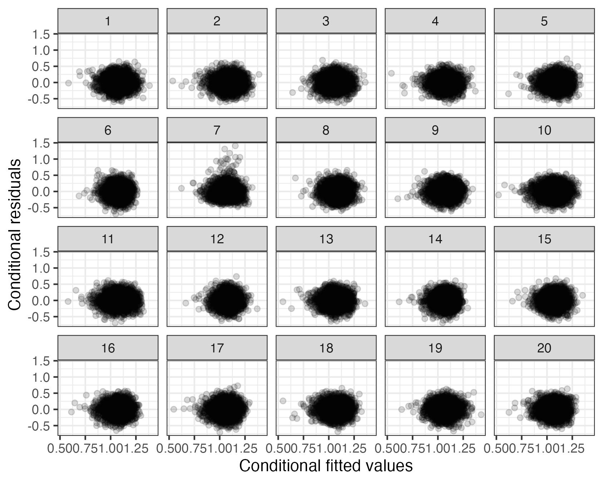

```{r setup, include=FALSE}
knitr::opts_chunk$set(echo = TRUE, dev = 'svg')

# Loading bib
library(RefManageR)
BibOptions(check.entries = FALSE,
           bib.style = "authoryear",
           cite.style = "authoryear",
           style = "markdown",
           hyperlink = FALSE,
           dashed = FALSE)
myBib <- ReadBib("./lmeresampler_jsm.bib", check = FALSE)
myBib <- sort(myBib)


# Packages
library(readr)
library(ggplot2)
library(dplyr)
library(tidyr)
library(forcats)
library(lme4)
library(HLMdiag)
library(qqplotr)
library(cowplot)
library(lmeresampler)

# Example data set, dropping NAs
osteo <- read_delim("ost phenotypes.dat", delim = "\t") %>%
  select(-contains("X")) %>%
  rename(BMD = `CalL2-L4BMD`) %>%
  mutate(Sex = as_factor(Gender) %>% fct_recode(male = "1", female = "2"), 
         CentreNumber = factor(CentreNumber)) %>%
  filter(Proband == "No") %>%
  drop_na(BMD, Sex, Age, Height, Weight, CentreNumber) %>%
  mutate(Age = Age - mean(Age),
         Height = Height - mean(Height),
         Weight = Weight - mean(Weight))

# Plot theming
theme_useR <- function(base_size = 28) {
  theme_bw(base_size = base_size) + 
    theme(legend.margin = margin(), legend.title = element_blank())
}

# Bootstrap results so that they don't need to be cached
load("jsm_boot_results.RData")

```


## Example

*  Osteoporosis study analyzed by `r Citet(myBib, "galwey2014")` and again by `r Citet(myBib, "Field2010-do")` 

* 2981 subjects recruited from 8 centers

* Bone mineral density (BMD) measured on each subject by an X-ray
scan of the lumbar region 

* Goal is to explore the relationship between BMD and the
sex, age, height, and weight of subjects

* 117 subjects have missing values

???

Before jumping into the bootstrap, let's consider an example where the bootstrap may be useful. 
This example comes from a textbook osteoporosis study analyzed by Galwey. 

There are 2981 subjects in the study who were recruited across 8 centers, so subjects
are nested within centers.

For each subject, Bone mineral density was measured by an X-ray scan of the lumbar region. 

The purpose of Galwey's analysis was to explore the relationship 
between Bone mineral density and the sex, age, height, and weight of the subjects.

117 cases had missing values on at least one of the predictors, so those cases were dropped for
simplicity.

---

## Initial mixed-effects model


`r Citet(myBib, "galwey2014")` propose this initial model

```{r galwey model}
fm <- lmer(BMD ~ Sex + Age + I(Age^2) + Height*Weight + 
             I(Height^2) + I(Weight^2) + (1|CentreNumber), 
           data = osteo)
```

* Fixed effects Sex, Age, Age<sup>2</sup>, Height, Height<sup>2</sup>, and Height $\times$ Weight

* Random intercept for CentreNumber

???

The initial model considered by Galwey included sex, linear and quadratic terms for age, height, and weight,
as well as the interaction between height and weight as predictors, and included a random intercept for the center number.

This model is easily fit via lmer in the lme4 R package.

---

## Conditional residuals

```{r galwey diagnostics, echo=FALSE, message=FALSE, fig.height = 3, fig.width = 9, out.width="100%", fig.show="hold", fig.alt ="Three residual plots. The left plot displays a histogram of the conditional residuals and is right skewed with some high outliers. The middle plot is a scatterplot of the conditional residuals plotted against the conditional fitted values. The largest conditional residuals do not stand out in terms of the fitted values. The rightmost plot is a normal Q-Q plot of the conditional residuals. The right skew and outliers are again evident."}
fm_resids <- hlm_resid(fm, standardize = FALSE, include.ls = FALSE)

dp1 <- 
  ggplot(data = fm_resids, aes(x = .resid)) + 
  geom_histogram() +
  labs(x = "Conditional residuals", y = "Frequency") +
  theme_minimal_grid()

dp2 <- 
  ggplot(data = fm_resids, aes(x = .fitted, y = .resid)) + 
  geom_point(alpha = 0.3) +
  labs(y = "Conditional residuals", x = "Conditional fitted values") +
  theme_minimal_grid()

dp3 <- ggplot(data = fm_resids, aes(sample = .resid)) +
  stat_qq_band(fill = "steelblue", alpha = 0.5) +
  stat_qq_line(color = "steelblue") +
  stat_qq_point() +
  labs(x = "Normal quantiles", y = "Conditional residuals") +
  theme_minimal_grid()
  
plot_grid(dp1, dp2, dp3, nrow = 1)
```

* Analysis of the conditional residuals reveal violation of condition that $\varepsilon \sim \mathcal{N}(\mathbf{0}, \sigma^2 \mathbf{I})$

* `r Citet(myBib, "galwey2014")` deletes 63 outliers identified from more extensive scans

???

After fitting the initial model, Galwey conducted a brief residual analysis, noting the 
apparent non-linearity of the conditional residuals or error terms.

To address this issue, Galwey deletes 63 outliers that were identified by more extensive scanning methods; 
however there is another option. While the model seems suspect either due to a distributional violation or
contamination with outliers, more robust analysis is still possible using methods such as the bootstrap.

Throughout this talk I'll guide you through how to implement bootstrap procedures for linear mixed-effects 
models in R, and also point to some additional applications.

---

## Bootstrapping LME models in R

```{r include=FALSE}
NoCite(myBib, "Van_der_Leeden2008")
```


- 2008 van der Leeden, Meijer, and Busing point out that R users must implement their own bootstrap procedures

- 2009 useR! talk by Sánchez-Espigares & Ocaña outlined a framework
    + parametric
    + semiparametric
    + Wild
    + semiparametric by block

- 2013 `lme4::bootMer()` implemented parametric bootstrap, semiparametric added later

???

In 2008, Van der Leeden and coauthors pointed out that many bootstrap procedures were unavailable in R, so users needed to program their own bootstraps if they wanted something other than the parametric bootstrap. 

In 2009, an R package was presented at useR! outlining a comprehensive framework for bootstrapping multilevel models; unfortunately, the package never made it's way to CRAN and the project appears to have been abandoned. 

Since that time, there have been a few additions to `lme4` in terms of bootstrapping capabilities, but numerous procedures are still missing. lmeresampler implements many of the missing procedures and is under active maintenance and development.

---

## lmeresampler

Implements a wider set of bootstrap algorithms available to `nlme` and `lme4` users

- parametric*

- residual (semi-parametric)*

- cases (non-parametric)*

- random-effects block

- wild

<br>

<br>

<br>

`*` = Also works with model fit via `lme4::glmer()`


???

lmeresampler provides users with easy access to a larger set of bootstrap procedures. 
Currently, it implements five procedures for Gaussian response models, including the parametric, 
residual, cases, random-effects block, and wild bootstraps. 

The parametric, residual, and cases bootstraps are also available for generalized linear mixed-effects 
models fit via `glmer`.
  

---

## Residual bootstrap

`r Citet(myBib, "Carpenter2003")` proposed a residual bootstrap for multilevel models

1. Fit the model via `lme4::lmer()` or `nlme::lme()`

2. Extract the error terms and random effects.

3. Mean-center and "reflate" them, so that the empirical covariance matrices of these residual quantities match the estimated covariance matrices prior to resampling.

4. Resample from the each residual quantity and generate bootstrap responses.

5. Refit the model and extract the quantities of interest.

6. Repeat 3-5 B times.

???

In our example, if we question the distributional assumption placed on the conditional residuals, 
then a robust alternative to typical parametric inference is the residual bootstrap proposed by 
Carpenter, Goldstein and Rasbash. The bootstrap procedure is similar to the residual bootstrap from classical regression, but there are two types of residuals: conditional residuals (sometimes called error terms) and random effects. In addition, before resampling the residual quantities, we center and reflate them. Carpenter et al. termed "reflation" as the adjustment made to the residuals to ensure the empirical covariance matrices match the estimated covariance matrices.

---

## Example

Implementing a residual bootstrap for Galwey's initial model

```{r eval=FALSE}
resid_boot <- bootstrap(
  fm,                 # lme4/nlme output 
  .f = fixef,         # user-specified function
  type = "residual",  # bootstrap algorithm
  B = 15000           # No. resamples
)
```

???

The residual bootstrap can be implemented for our fitted model, stored in the fm object, using the bootstrap() command. bootstrap() provides a unified interface to all of the bootstrap procedures implemented in lmeresampler.
In our example, we pass in out fitted model object, fm, followed by three key arguments. 

The first argument, .f, specifies the quantities of interest that should be calculated and stored during reach bootstrap iteration. Here, we use fixef to extract the fixed effect estimates. 
Next, we specify the type of bootstrap by setting type equal to residual. 
Finally, we set the number of bootstrap resamples to 15K.

The bootstrap results are then stored in the resid_boot object.

---

## Summary

```{r}
summary(resid_boot)
```

???

bootstrap returns an object of class lmeresamp, and we've provided familiar methods to explore the results. For example, the summary function allows us to quickly explore the mean, standard error, and bias of our results. It also informs us of any warnings encountered along the way, such as convergence issues. 


---

## Confidence intervals

```{r}
confint(resid_boot, type = "basic", level = 0.89)
```

`type = "norm"` or `"perc"` also implemented


???

The confint function provides normal, basic, and percentile bootstrap confidences intervals for all of the parameters by default. Here, we calculate only basic bootstrap intervals by setting type equal to "basic".

---

## Plots

Halfeye plots are produced via `ggdist` `r Citet(myBib, "ggdist")`

```{r eval=FALSE}
plot(resid_boot, var = "Age")
plot(resid_boot, var = "I(Age^2)")
```

```{r echo=FALSE, fig.height = 3, fig.width = 3, fig.show='hold', fig.alt = "Two half-eye plots, the left plot shows the boostrap distribution of the coeffecient for age, the right plots shows the bootstrap distribution for age squared."}
plot(resid_boot, var = "Age") + ylab("density")
plot(resid_boot, var = "I(Age^2)") + ylab("density")
```


???

You can create plots of the bootstrap distributions for each quantity using the plot() command. Halfeye plots are produced using the ggdist package. A half-eye plot consists of a density plot with intervals highlighted below. The central 66% and 95% percentile intervals are displayed by default.

Note that to display individual distribution plots, you can either specify the quantity of interest as a character vector or an index value.

---

## `lmesamp` objects

```{r}
names(resid_boot)
```

???

An lmeresamp object is just a list with the following named elements, so you may want to access specific components


--

Extract the bootstrap statistics

```{r eval=FALSE}
resid_boot$replicates
```
```{r echo=FALSE}
print(resid_boot$replicates, n = 5, width = 70)
```

???

For example, you may need to extract the bootstrap statistics, which is easily done using the $ extractor.


---

## Speeding things up

You can easily utilize parallel processing to speed up the computation via `foreach`

```{r eval=FALSE}
library(foreach)
library(doParallel)

no_cores <- 5
cl <- makeCluster(no_cores, type = "FORK")
registerDoParallel(cores = no_cores)

boot_parallel <- foreach(
  B = rep(3000, 5), 
  .combine = combine_lmeresamp) %dopar% {
    bootstrap(fm, .f = fixef, type = "residual", B = B)
  }
stopCluster(cl)
```

???

Bootstrapping is a computationally demanding task, but is easily run in parallel since each iteration of the bootstrap requires no interaction with other iterations. We did not implement parallel processing within lmeresampler, rather we provide the combine_lmeresamp function so that the user can implement parallelization via the foreach package. This provides flexibility to the user, allowing them to choose the type of cluster based on their situation and hardware setup.

In this example, I'm using a small fork cluster with five cores. Within the foreach call, I specify that B = 3000 replicates should be run on each of the five cores and then the combine_lmeresamp() function should be used to combine the results. I then use the dopar operator to call the bootstrap command we discussed previously.

--

.pull-left[
Sequential runtime
```{r echo=FALSE}
stime
```

]

.pull-right[
Parallel runtime
```{r echo=FALSE}
ptime
```

]


???

On my laptop, the runtime decreased by a factor of about `r round(stime[3] / ptime[3], 1)`.


---

## Unified framework

In `bootstrap()`, change `type` and set additional parameters to run a different procedure


Example: Case bootstrap example, resampling only the subjects within centers

```{r eval=FALSE}
case_boot <- bootstrap(fm, .f = fixef, type = "case", 
                       B = 15000, resample = c(FALSE, TRUE)
                       )
```

???

So far, we've only used the residual bootstrap, but other procedures are easily implement by changing the type and passing in any additional required arguments. For example, if we wished to utilize the non-parametric cases bootstrap, we set type equal to case, and the have to add the resample argument, which specifies which levels of the model should be resampled, starting with the topmost level. Here we set resample to FALSE, TRUE, indicating that we should not resample center, but should resample subjects within centers.

--

|Bootstrap $\qquad$   | Type  $\qquad$       | Required arguments|
|:---------------|:-------------------|:-----------|
|Cases      | `"case"`       | `model, .f, type, B, resample`|
|Residual   | `"residual"`   | `model, .f, type, B`|
|REB        | `"reb"`        | `model, .f, type, B, reb_type`|
|Wild       | `"wild"`       | `model, .f, type, B, hccme, aux.dist`|
|Parametric | `"parametric"` | `model, .f, type, B`|


???

Here is a table providing the required arguments for each type of bootstrap.

---

## Simulation-based diagnostics

`r Citet(myBib, "Loy2017")` recommends using lineups to visually diagnose LME models

.pull-left[
* Plot residuals vs. fitted values/predictor/group index

* .bold[Generate decoy (null) data sets where we know the model assumptions are upheld]

* Make plots of the decoy data sets

* Render the lineup via faceting
]

.pull-right[
```{r include=FALSE}
set.seed(62758)
```

```{r lineup, eval = FALSE, echo=FALSE, cache=TRUE, fig.height = 6, fig.width = 7.5, message=FALSE, out.width="120%"}
library(HLMdiag) # easy residual extraction
library(nullabor) # easy lineup data wrangling
decoy_resids <- bootstrap(fm, .f = hlm_resid, type = "parametric", B = 19)
lineup_data  <- lineup(true = hlm_resid(fm), n = 19, samples = decoy_resids$replicates) 

ggplot(data = lineup_data, aes(x = .fitted, y = .resid)) + 
  geom_point(alpha = 0.15) +
  labs(y = "Conditional residuals", x = "Conditional fitted values") +
  facet_wrap(~.sample) +
  theme_bw()

height <- 4.5
ggsave("lineup.jpg", width = 1.25 * height, height = height)
```

```{r, out.width="120%", echo=FALSE, fig.alt = "A lineup of residual plots rendered from Galeway's model. 19 panels display decoy residuals generated from a parametric bootstrap. The true residuals are embedded in the lineup in pael 7 and appear different from the decoys, indicating a potential model deficiency."}

```


]

???

Now that you have seen the basic of what lmeresampler can do, let's look at another example. In my 2017 paper with Heike Hofmann and Di Cook, we recommend using lineups of residual plots to diagnose linear mixed-effects models. To construct a lineup, we need to identify and create a plot of interest, simulated decoy data sets where we know the model assumptions are upheld, generate plots from these decoy data sets, and finally render the lineup through faceting.

Prior to lmeresampler, this was a tedious process.

---

Load helper packages for lineups
```{r eval=FALSE}
library(HLMdiag) # easy residual extraction
library(nullabor) # easy lineup data wrangling
```

???

Let's walk through how to construct such a lineup. I'll pull in additional diagnostic tools from the HLMdiag package, and some data wrangling functions from the nullabor package.

--

Generate "decoy data" via parametric bootstrap
```{r eval=FALSE}
decoys <- bootstrap(fm, .f = hlm_resid, type = "parametric", B = 19)
```

???

The parametric bootstrap can be used to generate decoy data via the bootstrap function. Here we generate 19 decoy data sets, since we want to create a lineup with 20 facets. Notice here that we extract the hlm residuals for each bootstrap replicate.

--

Randomly embed real residual data into the field of decoys
```{r eval=FALSE}
lineup_data <- lineup(true = hlm_resid(fm), n = 19, 
                      samples = decoys$replicates) 
```

???

We combine and format the true residuals extract from fm with the decoy residuals obtained from the bootstrap using nullabor's lineup function.

--

Create a faceted scatterplot
```{r eval=FALSE}
ggplot(data = lineup_data, aes(x = .fitted, y = .resid)) + 
  geom_point(alpha = 0.25) +
  labs(y = "Conditional residuals", x = "Conditional fitted values") +
  facet_wrap(~.sample) +
  theme_bw()
```

???

Finally, we can use typical ggplot2 code to render the faceted scatterplot.

---

### Get the package

Stable version on CRAN
```{r eval=FALSE}
install.packages("lmeresampler")
```

Development version on GitHub
```{r eval=FALSE}
remotes::install_github("aloy/lmeresampler")
```

???

Thanks for watching my extended presentation! If you want to install lmeresampler and explore its functionality, you can obtain the stable version from CRAN or download the development version from GitHub. 

--

### Read about the package

Documentation and examples: https://aloy.github.io/lmeresampler/

Read the preprint: https://arxiv.org/a/loy_a_1.html

???

You can also find documentation on the lmeresampler GitHub page, and can read a preprint detailing the functionality and a few additional use cases on the arxiv.


---

#### References

```{r echo=FALSE, results='asis'}
print(myBib[1:5])
```

---

#### References

```{r echo=FALSE, results='asis'}
print(myBib[6:7])
```